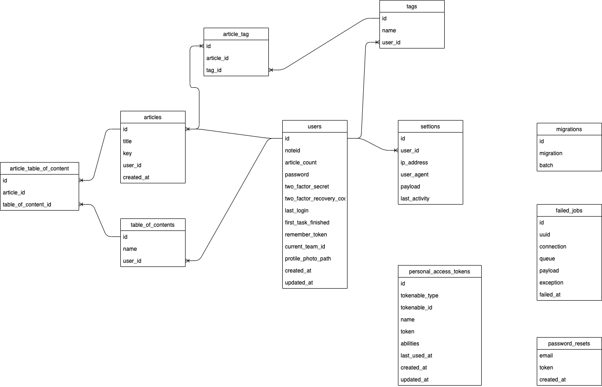

# 簡易仕様書

### 作者
坂井俊文
### アプリ名
OrganizeNote-ver2

### 公開URL
https://organizenote-ver2.herokuapp.com/

### 該当プロジェクトのリポジトリ URL（GitHub,GitLab など Git ホスティングサービスを利用されている場合）
https://github.com/SakaiTaka23/OrganizeNote-ver2

## 動作対象OS・ブラウザ

### 動作OS

以下で確認済み

iphone 6,7,8,X ipad

galaxy s5

mac os

### 動作ブラウザ

以下で確認済み

google chrome safari

## 開発環境・言語

### 開発環境
Visual Studio Code

### 開発言語
PHP 7.3

## 機能概要

### 機能一覧
- 認証機能 : ログイン・ログアウトの基本的な認証機能
- プロフィール表示機能 : 現在のプロフィール(アカウント名やフォロワー数、記事の総数)を表示

- 検索機能 : 記事の検索を行う
- 一覧表示機能 : 投稿日時の近いものを一覧で表示

### 画面一覧
- ランディングページ : アプリケーションの概要が表示される
- インデックスページ : 投稿した記事を新しい順に表示、題名や投稿期間での絞り込みも可能
- タグ一覧表示ページ : 今まで投稿した記事のタグ一覧とその回数を表示、クリックをすることにより該当のタグを使っている記事一覧を確認することが可能
- 目次一覧ページ : 目次をランダムに表示しその目次がある記事を表示、目次の検索もできる
- プロフィールページ : ユーザーの名前や記事数・フォロワー数を表示
- 設定ページ : パスワード変更や二段階認証の設定、セッションが繋がっている機器の確認や退会が可能

## 使用ライブラリ・フレームワーク
- noteAPI
- Laravel 8.0
- MySQL 8.0

## テーブル定義

## コンセプト

#### コンセプト

過去の記事の検索・参照

#### 作成動機

noteで日記を書いている時に過去の記事のリンクを付けたい時や紹介したい時がよくあった。しかし、note自体に過去の記事を振り返るといった機能が乏しく過去の記事を探すことが困難であったため作成。

## こだわったポイント

- アーキテクチャに関してMVCに加えServiceという役割を新たに作成。Serviceではデータベース操作に関するロジックを実装しファットモデル・ファットコントローラーを回避できるよう心がけた

- 記事のタイトルや目次、タグ、投稿日時といった様々な方法で記事の検索が可能
- 実際の検索後実際にその記事を閲覧することができるようリンクを実装
- スケジューラーによる検索できる記事の更新
- 複雑な処理や定期的に実行するスケジュール処理に関しては専用のコマンドを作成することによってエントリーポイントを一つにまとめ実行・テストが容易にできるようにした

## デザイン面でこだわったポイント

- ダークモード、ライトモードによるUIの向上
- 検索後はページネーションを加えることにより１ページの情報量を制御した
- ログイン後の画面は「管理者画面」を意識しページ遷移用のタブを横側につけた

## 自己評価

DIに関してはこのアプリケーションでの学習が初めてでありその必要性やLaravelでのDIの実装方法に関して学習しながら実装を進めた。それ以外にもLaravelでのコマンドの作成やバリデーションルールの作成など今までは触れてこなかったLaravelの応用についても学ぶことができた。

第三者の方にもアドバイスを得ながら進めて行き最終的には満足の行くアプリケーションを作成することができた。